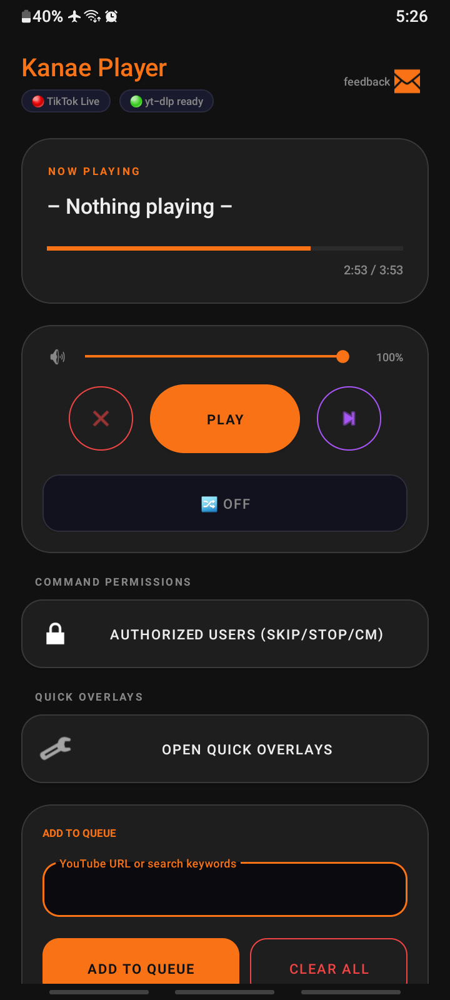
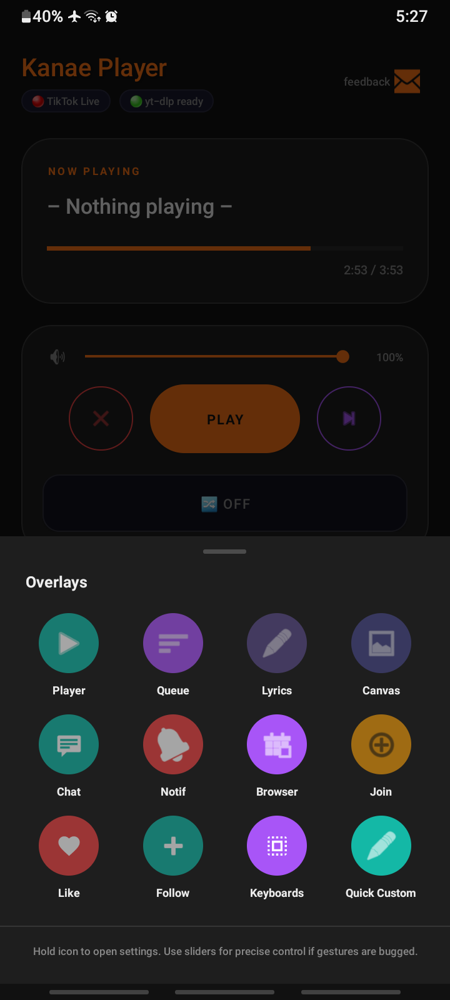
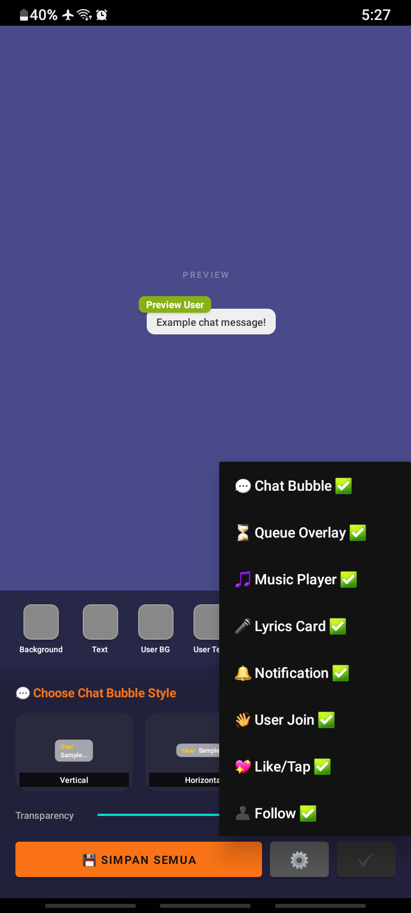
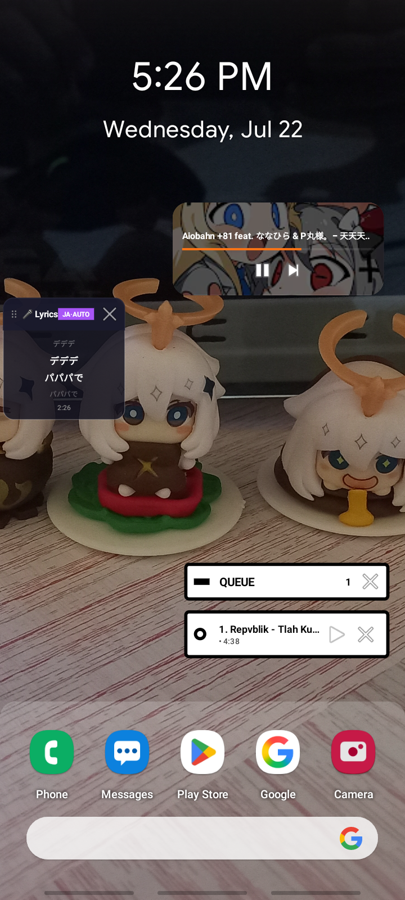

# 🎵 KanaePlayer – Ultimate YouTube x TikTok Live Integration

**KanaePlayer** adalah aplikasi pemutar audio YouTube revolusioner yang dirancang khusus untuk streamer android TikTok. Aplikasi ini memungkinkan penonton Anda melakukan request lagu secara real-time melalui chat TikTok Live, lengkap dengan sistem overlay yang canggih dan stabil.

---

## 📸 Screenshots

  
  
  
  

---

## ✨ Fitur Unggulan

- **🚀 YouTube Audio Streaming**: Pemutaran audio super ringan dengan arsitektur dual-engine (**NewPipeExtractor** + **yt-dlp** sebagai fallback).
- **💬 TikTok Live Chat Sync**: Integrasi mulus dengan TikTok Live menggunakan **EulerStream API**.
- **🖼️ Advanced Floating Overlays**:
  - **Playing Overlay**: Menampilkan informasi lagu saat ini.
  - **Queue Overlay**: Daftar antrian lagu yang transparan.
  - **Chat & Event Overlays**: Menampilkan chat, stiker, gift, join, dan follow secara real-time.
- **🛡️ Anti-Bot Bypass**: Sistem **PoTokenGenerator** (WebView-based) unik untuk menghindari error 403 & blokir YouTube.
- **📻 Background Playback**: Berjalan sebagai Foreground Service agar musik tetap mengalir meskipun layar mati.
- **🎮 Chat Command System**: Kendali penuh via chat (`#req`, `#skip`, `#seekbar`, dll) yang bisa dikustomisasi.
- **🎨 Custom Styling**: Atur gaya visual, durasi, dan posisi overlay sesuai keinginan Anda.

---

## 🆕 Pembaruan Terkini (v12.3.8)

- **Custom Audio Events**: Mendukung penggunaan audio kustom untuk notifikasi Join dan Follow.
- **BottomSheet Improvement**: Peningkatan stabilitas dan tampilan pada bottomsheet overlay.
- **Small Fixes**: Perbaikan ProGuard dan bug minor lainnya.

## 🆕 Pembaruan Sebelumnya (v12.3.6)

- **Bug Fixes**: Perbaikan beberapa kendala bug di sebagian hp.
- **Library Update**: Pembaruan beberapa library sistem untuk performa lebih stabil.
- **Media Player Style**: Penambahan desain gaya baru untuk media player.

## 🆕 Pembaruan Sebelumnya (v12.3.4)

- **Authorized User**: Kontrol penuh siapa yang bisa melakukan skip lagu (Followers atau User Spesifik).
- **AIDL Fix**: Perbaikan sinkronisasi dengan aplikasi NL Studio.

## 🆕 Pembaruan Sebelumnya (v12.3.0)

- **Background Stability**: Implementasi *Auto-Renewing Wake Lock* dan optimasi prioritas thread untuk mencegah aplikasi terhenti di background.
- **Battery Optimization**: Fitur dialog otomatis untuk memudahkan pengguna memberikan pengecualian baterai (Battery Optimization Exemption).
- **Service Enhancement**: Peningkatan prioritas Notification Channel untuk stabilitas streaming yang lebih konsisten pada berbagai ROM Android.

---

## 🛠️ Tech Stack

| Kategori | Teknologi |
|---|---|
| **Audio Engine** | Media3 ExoPlayer |
| **Extraction** | NewPipeExtractor (Primary) + yt-dlp (Fallback) |
| **Bypass Logic** | Custom Po-Token Generator (WebView + BotGuard VM) |
| **Live Sync** | EulerStream API (WebSocket + HTTP Fallback) |
| **UI/UX** | XML Layouts + Material Components + WindowManager |
| **Image Engine** | Glide |

---

## 🚀 Persiapan & Instalasi

### 1. Prasyarat
- Android 8.0 (Oreo) atau lebih tinggi.
- API Key dari [EulerStream](https://eulerstream.com).

### 2. Langkah Setup
1. **Instal APK**: Download dan instal versi terbaru.
2. **Konfigurasi API**: Masuk ke menu **SETTINGS**, masukkan **API Key** dan **Username TikTok** Anda.
3. **Izinkan Overlay**: Klik "Grant Overlay Permission" agar aplikasi bisa menampilkan jendela melayang.
4. **Optimasi Baterai**: Nonaktifkan pembatasan baterai agar service tidak terhenti di background.

---

## ⌨️ Perintah Chat (Commands)

| Perintah | Fungsi | Contoh |
|:---:|---|---|
| `#req` | Menambah lagu ke antrian | `#req Lathi` atau `#req [URL]` |
| `#skip` | Melewati lagu saat ini | `#skip` |
| `#q` | Melihat daftar antrian | `#q` |
| `#stop` | Menghentikan musik | `#stop` |
| `#seekbar` | Toggle Untuk Mematikan fungsi command atau tidak | `#seekbar on` |
| `#cm` | Menghapus antrian spesifik | `#cm 1` |

> [!TIP]
> Semua prefix dan nama perintah dapat diubah melalui menu **Settings** di dalam aplikasi!

---

## 📂 Arsitektur Proyek

- **`YtDlpHelper`**: Mengelola arsitektur *dual-library*. Jika **NewPipeExtractor** gagal (misal: karena update YouTube yang mematahkan extractor), aplikasi akan otomatis beralih ke **yt-dlp** untuk menjamin keberhasilan streaming.
- **`PlayerForegroundService`**: Jantung aplikasi yang mengelola audio, chat socket, dan lifecycle overlay.
- **`NewPipeDownloader`**: Menangani otentikasi YouTube dengan menyuntikkan `X-Goog-Po-Token`.
- **`PoTokenGenerator`**: Generator token otomatis menggunakan skrip BotGuard tersembunyi.
- **`OverlayManager`**: Sistem manajemen jendela melayang yang mendukung interaksi drag-and-drop.

---

## ⚠️ Troubleshooting

- **Error 403 / Sign-in Required**: Cek tab `PoTokenGenerator` di log, pastikan generator berjalan.
- **Chat Terputus**: Gunakan fitur *Auto-Reconnection* yang akan mencoba menyambung kembali hingga 5 kali.
- **Overlay Hilang**: Pastikan izin "Display over other apps" sudah aktif.

---

## 🤝 Kontribusi & Dukungan

Proyek ini dikembangkan dengan ❤️ untuk komunitas streamer.

- **Donasi**: Dukung pengembangan lebih lanjut melalui [Saweria](https://saweria.co/shinriMe).
- **Disclaimer**: Gunakan aplikasi ini dengan bijak sesuai kebijakan platform YouTube dan TikTok.

---
Copyright © 2026 **KanaePlayer Team**.
